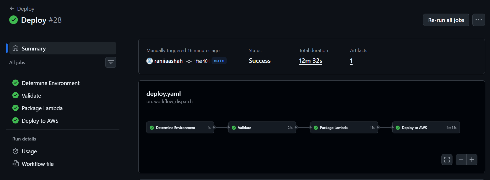
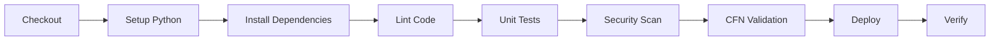
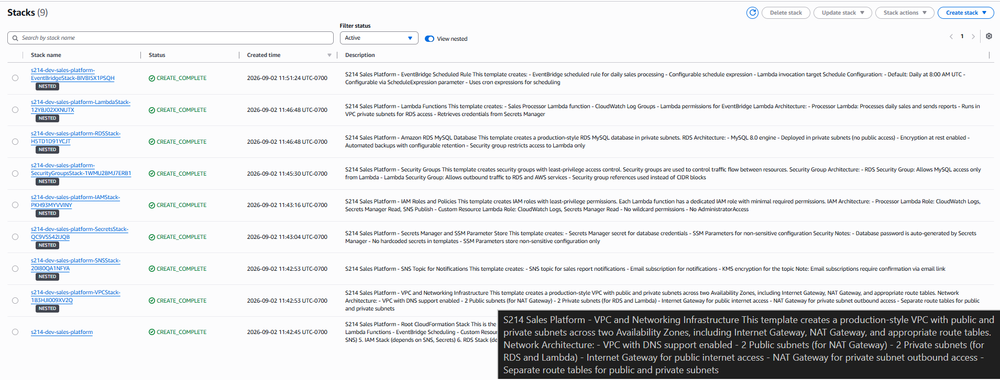

# S214 — Production-Grade Sales Data Processing & Notification Platform

[](https://github.com/username/s214-sales-platform/actions/workflows/ci.yaml)
[](https://github.com/username/s214-sales-platform/actions/workflows/ci.yaml)
[](https://opensource.org/licenses/MIT)
[](https://aws.amazon.com/cloudformation/)
[](https://www.python.org/)

Production-grade serverless AWS sales processing platform built with CloudFormation, Lambda, RDS, EventBridge, SNS, Secrets Manager, GitHub Actions and automated security testing.

---

## Table of Contents

- [Overview](#overview)
- [Architecture](#architecture)
- [Features](#features)
- [AWS Services](#aws-services)
- [Technology Stack](#technology-stack)
- [Repository Structure](#repository-structure)
- [Prerequisites](#prerequisites)
- [AWS Authentication](#aws-authentication)
- [Configuration](#configuration)
- [Deployment](#deployment)
- [CI/CD](#cicd)
- [Database Schema](#database-schema)
- [Lambda Processing Flow](#lambda-processing-flow)
- [EventBridge Schedule](#eventbridge-schedule)
- [SNS Notifications](#sns-notifications)
- [Security](#security)
- [Monitoring](#monitoring)
- [Testing](#testing)
- [Troubleshooting](#troubleshooting)
- [Cost Optimization](#cost-optimization)
- [Disaster Recovery](#disaster-recovery)
- [Cleanup](#cleanup)
- [Future Improvements](#future-improvements)
- [Project Highlights](#project-highlights)
- [Business Value](#business-value)
- [License](#license)

---

## Overview

This platform automates daily sales data processing and reporting using AWS serverless technologies. It demonstrates professional DevOps engineering practices including Infrastructure as Code, CI/CD automation, security scanning, and observability.

The application processes sales data from Amazon RDS and delivers automated reports through Amazon SNS, all orchestrated by EventBridge on a configurable schedule.

---

## Architecture


### Architecture Components

```
                GitHub
                   |
                   v
              CI/CD Pipeline
                   |
                   v
            CloudFormation
                   |
                   v
                 AWS
                   |
    +--------------+--------------+
    |                             |
    v                             v
   VPC                     Secrets Manager
    |
    +----+-----------------------+
         |                       |
         v                       v
    Private Subnets            Public Subnets
         |
         +----------+
         |          |
         v          v
        RDS       Lambda
         |
         +------+------+
         |             |
         v             v
        SNS        CloudWatch
         |
         v
        Email

    EventBridge
         |
         v
       Lambda
```

### Network Architecture

- **VPC** with public and private subnets across 2 Availability Zones
- **Internet Gateway** for public subnet internet access
- **NAT Gateway** for private subnet outbound connectivity
- **RDS** deployed in private subnets (no public access)
- **Lambda** running in private subnets with VPC access

---

## Features

- **Automated Sales Processing**: Daily aggregation of sales metrics
- **Secure Database**: RDS MySQL in private subnets with encryption
- **Secrets Management**: Credentials stored in AWS Secrets Manager
- **Event-Driven**: Scheduled execution via EventBridge
- **Notifications**: Email delivery via SNS
- **Infrastructure as Code**: Complete CloudFormation automation
- **CI/CD Pipeline**: GitHub Actions with security scanning
- **Multi-Environment**: Dev, staging, and production support
- **Observability**: CloudWatch logging and metrics
- **Security**: Least-privilege IAM, security groups, and encryption

---

## AWS Services

| Service | Purpose |
|---------|---------|
| AWS Lambda | Serverless compute for sales processing |
| Amazon RDS | MySQL database for sales data |
| Amazon VPC | Network isolation and security |
| Amazon SNS | Email notifications |
| Amazon EventBridge | Scheduled execution |
| AWS Secrets Manager | Credential storage |
| AWS SSM Parameter Store | Configuration management |
| AWS IAM | Access control and permissions |
| AWS CloudWatch | Logging and monitoring |
| AWS CloudFormation | Infrastructure as Code |

---

## Technology Stack

- **CloudFormation**: Infrastructure as Code
- **Python 3.11**: Lambda runtime
- **Boto3**: AWS SDK for Python
- **GitHub Actions**: CI/CD automation
- **pytest**: Unit testing
- **cfn-lint**: CloudFormation validation
- **Bandit**: Python security scanning
- **Trivy**: Vulnerability scanning

---

## Repository Structure

```
s214-sales-platform/
│
├── README.md
├── LICENSE
├── .gitignore
├── CONTRIBUTING.md
├── SECURITY.md
├── CHANGELOG.md
│
├── docs/
│   ├── architecture.md
│   ├── deployment.md
│   ├── security.md
│   ├── troubleshooting.md
│   └── screenshots/
│
├── diagram/
│   └── architecture.png
│
├── infrastructure/
│   ├── root.yaml
│   ├── vpc.yaml
│   ├── security-groups.yaml
│   ├── iam.yaml
│   ├── secrets.yaml
│   ├── rds.yaml
│   ├── sns.yaml
│   ├── lambda.yaml
│   ├── eventbridge.yaml
│   └── parameters.yaml
│
├── src/
│   ├── processor/
│   │   ├── lambda_function.py
│   │   ├── database.py
│   │   ├── sales.py
│   │   ├── notification.py
│   │   └── requirements.txt
│   │
│   └── custom-resource/
│       ├── lambda_function.py
│       ├── database.py
│       └── requirements.txt
│
├── tests/
│   ├── unit/
│   │   ├── test_sales.py
│   │   ├── test_notification.py
│   │   └── test_database.py
│   └── integration/
│       └── README.md
│
├── scripts/
│   ├── validate.sh
│   ├── package.sh
│   ├── deploy.sh
│   ├── test.sh
│   └── destroy.sh
│
├── config/
│   ├── dev.yaml
│   ├── staging.yaml
│   └── prod.yaml
│
└── .github/
    └── workflows/
        ├── ci.yaml
        └── deploy.yaml
```

---

## Prerequisites

### Required Tools

- [AWS CLI](https://aws.amazon.com/cli/) v2.0+
- [Python](https://www.python.org/) 3.11+
- [Git](https://git-scm.com/)
- [cfn-lint](https://github.com/aws-cloudformation/cfn-lint) (optional, for local validation)

### AWS Requirements

- AWS Account with appropriate limits
- IAM user/role with CloudFormation deployment permissions
- Configured AWS CLI credentials

### Python Dependencies

```bash
pip install boto3 pytest flake8 black mypy bandit pip-audit
```

---

## AWS Authentication

### GitHub Actions OIDC (Recommended)

This project uses OpenID Connect (OIDC) for secure, credential-free authentication between GitHub Actions and AWS.

**Setup Steps:**

1. Create an IAM OIDC Provider for GitHub:
```bash
aws iam create-open-id-connect-provider \
  --url https://token.actions.githubusercontent.com \
  --thumbprint-list <thumbprint> \
  --client-id-list sts.amazonaws.com
```

2. Create an IAM Role with trust policy for GitHub:
```json
{
  "Version": "2012-10-17",
  "Statement": [
    {
      "Effect": "Allow",
      "Principal": {
        "Federated": "arn:aws:iam::<account-id>:oidc-provider/token.actions.githubusercontent.com"
      },
      "Action": "sts:AssumeRoleWithWebIdentity",
      "Condition": {
        "StringEquals": {
          "token.actions.githubusercontent.com:aud": "sts.amazonaws.com"
        },
        "StringLike": {
          "token.actions.githubusercontent.com:sub": "repo:username/s214-sales-platform:*"
        }
      }
    }
  ]
}
```

3. Add the role ARN as a GitHub Secret (`AWS_ROLE_ARN`)

### Local Development

For local deployment, configure AWS credentials:

```bash
aws configure
# Or use environment variables:
export AWS_ACCESS_KEY_ID=your_access_key
export AWS_SECRET_ACCESS_KEY=your_secret_key
export AWS_REGION=us-east-1
```

---

## Configuration

### Environment Configuration

Edit the configuration files in `config/`:

**config/dev.yaml:**
```yaml
environment: dev
region: us-east-1
vpc:
  cidr: 10.0.0.0/16
rds:
  instanceClass: db.t3.micro
  allocatedStorage: 20
  backupRetention: 1
lambda:
  memorySize: 128
  timeout: 60
eventbridge:
  schedule: "cron(0 8 * * ? *)"  # Daily at 8 AM UTC
sns:
  notificationEmail: dev@example.com
```

**config/staging.yaml:**
```yaml
environment: staging
region: us-east-1
vpc:
  cidr: 10.1.0.0/16
rds:
  instanceClass: db.t3.small
  allocatedStorage: 20
  backupRetention: 7
lambda:
  memorySize: 256
  timeout: 120
eventbridge:
  schedule: "cron(0 8 * * ? *)"
sns:
  notificationEmail: staging@example.com
```

**config/prod.yaml:**
```yaml
environment: prod
region: us-east-1
vpc:
  cidr: 10.2.0.0/16
rds:
  instanceClass: db.t3.medium
  allocatedStorage: 100
  backupRetention: 30
lambda:
  memorySize: 512
  timeout: 300
eventbridge:
  schedule: "cron(0 8 * * ? *)"
sns:
  notificationEmail: alerts@example.com
```

### SSM Parameter Store

Non-sensitive configuration is stored in SSM Parameter Store:

| Parameter | Description |
|-----------|-------------|
| `/s214/{env}/vpc-id` | VPC identifier |
| `/s214/{env}/rds-endpoint` | RDS endpoint address |
| `/s214/{env}/sns-topic-arn` | SNS topic ARN |
| `/s214/{env}/secret-arn` | Secrets Manager ARN |

---

## Deployment

### Quick Deploy

```bash
# Validate templates
./scripts/validate.sh

# Deploy to dev environment
./scripts/deploy.sh dev

# Deploy to staging
./scripts/deploy.sh staging

# Deploy to production
./scripts/deploy.sh prod
```

### Manual Deployment

```bash
# Package Lambda functions
./scripts/package.sh

# Deploy CloudFormation stack
aws cloudformation deploy \
  --template-file infrastructure/root.yaml \
  --stack-name s214-dev-sales-platform \
  --parameter-overrides \
    Environment=dev \
    ConfigBucket=your-config-bucket \
  --capabilities CAPABILITY_NAMED_IAM \
  --no-fail-on-empty-changeset
```

### Deployment Steps

1. **Validate**: CloudFormation templates are validated
2. **Package**: Lambda code is packaged and uploaded to S3
3. **Deploy**: CloudFormation stack is created/updated
4. **Initialize**: Custom Resource creates database schema and sample data
5. **Verify**: Stack outputs are displayed

### Deployment Verification

The GitHub Actions deployment completed successfully:



---

## CI/CD

### GitHub Actions Workflows

**ci.yaml** - Continuous Integration:
- Triggered on pull requests and pushes to main
- Runs linting, unit tests, security scans
- Validates CloudFormation templates
- Checks Python dependencies for vulnerabilities

**deploy.yaml** - Continuous Deployment:
- Triggered on pushes to main branch
- Deploys to dev environment automatically
- Requires manual approval for staging/production
- Runs post-deployment verification

### Pipeline Stages



---

## Database Schema

### Tables

**sales**
```sql
CREATE TABLE sales (
    id INT AUTO_INCREMENT PRIMARY KEY,
    order_id VARCHAR(50) NOT NULL,
    product_name VARCHAR(255) NOT NULL,
    category VARCHAR(100) NOT NULL,
    quantity INT NOT NULL,
    unit_price DECIMAL(10,2) NOT NULL,
    total_amount DECIMAL(10,2) NOT NULL,
    sale_date DATE NOT NULL,
    created_at TIMESTAMP DEFAULT CURRENT_TIMESTAMP,
    INDEX idx_sale_date (sale_date),
    INDEX idx_category (category)
);
```

### Sample Data

The Custom Resource Lambda populates the database with sample sales data for demonstration purposes.

---

## Lambda Processing Flow

### Processor Lambda

1. **Trigger**: EventBridge scheduled rule invokes Lambda
2. **Connect**: Retrieve database credentials from Secrets Manager
3. **Query**: Fetch sales data for the specified date
4. **Calculate**: Compute business metrics
5. **Format**: Generate professional report
6. **Publish**: Send report via SNS
7. **Log**: Record processing details in CloudWatch

### Metrics Calculated

- Total Orders
- Total Quantity Sold
- Total Revenue
- Average Order Value
- Top-Selling Product
- Top Category
- Daily Sales Summary
- Sales by Category

### Report Format

```
========================================
       DAILY SALES REPORT
========================================
Date: 2024-01-15
Environment: dev

SUMMARY
-------
Total Orders: 150
Total Quantity: 450
Total Revenue: $12,500.00
Average Order Value: $83.33

TOP PERFORMERS
--------------
Top Product: Wireless Headphones
Top Category: Electronics

SALES BY CATEGORY
-----------------
Electronics: $5,000.00
Clothing: $3,500.00
Home & Garden: $2,500.00
Sports: $1,500.00

========================================
Generated by: AWS Lambda
Timestamp: 2024-01-15T08:00:00Z
========================================
```

---

## EventBridge Schedule

### Configuration

The EventBridge rule triggers the processor Lambda on a configurable schedule.

**Default Schedule**: Daily at 8:00 AM UTC

**Cron Expression**: `cron(0 8 * * ? *)`

### Schedule Modification

To change the schedule, update the configuration file:

```yaml
eventbridge:
  schedule: "cron(0 12 * * ? *)"  # Daily at 12 PM UTC
```

Common schedule patterns:
- Hourly: `cron(0 * * * ? *)`
- Every 6 hours: `cron(0 0/6 * * ? *)`
- Weekly (Monday 9 AM): `cron(0 9 ? * MON *)`

---

## SNS Notifications

### Email Subscription

1. Deploy the stack with a notification email
2. SNS sends a confirmation email
3. Click the confirmation link to activate subscription
4. Future reports will be delivered to the confirmed email

### Important Notes

- Email subscriptions require confirmation
- Check spam/junk folders for confirmation emails
- Multiple email addresses can be subscribed via AWS Console
- SNS topic ARN is available in CloudWatch outputs

---

## Security

### Security Measures

1. **Network Isolation**
   - RDS in private subnets (no public access)
   - Lambda in VPC with security groups
   - Security group rules restrict traffic flow

2. **Secrets Management**
   - Database credentials in Secrets Manager
   - No hardcoded passwords or credentials
   - Automatic credential rotation support

3. **IAM Least Privilege**
   - Dedicated IAM roles for each Lambda
   - Minimal required permissions
   - No wildcard permissions

4. **Encryption**
   - RDS encryption at rest
   - Secrets Manager encryption
   - SNS topic encryption

5. **Security Scanning**
   - Bandit for Python code analysis
   - pip-audit for dependency vulnerabilities
   - cfn-lint for CloudFormation security
   - Trivy for comprehensive scanning

### IAM Roles

| Role | Permissions |
|------|-------------|
| Processor Lambda | CloudWatch Logs, Secrets Manager Read, SNS Publish |
| Custom Resource Lambda | CloudWatch Logs, Secrets Manager Read |

### Security Groups

| Group | Inbound | Outbound |
|-------|---------|----------|
| RDS | Port 3306 from Lambda SG | All traffic |
| Lambda | None | All traffic |

---

## Monitoring

### CloudWatch Logs

Lambda functions log to CloudWatch:
- `/aws/lambda/s214-{env}-sales-processor`
- `/aws/lambda/s214-{env}-custom-resource`

### CloudWatch Metrics

| Metric | Namespace | Description |
|--------|-----------|-------------|
| Invocations | AWS/Lambda | Number of Lambda invocations |
| Errors | AWS/Lambda | Number of failed invocations |
| Duration | AWS/Lambda | Execution time in milliseconds |
| Throttles | AWS/Lambda | Number of throttled invocations |

### CloudWatch Alarms

Configure alarms for:
- Lambda errors exceeding threshold
- Lambda duration exceeding threshold
- Lambda throttling events

---

## Testing

### Unit Tests

```bash
# Run all tests
./scripts/test.sh

# Run with coverage
pytest tests/ -v --cov=src --cov-report=html
```

### Test Coverage

- Sales calculation logic
- Report generation
- Database query handling
- Notification formatting
- Error handling

### Integration Tests

Integration tests require AWS deployment. See `tests/integration/README.md` for details.

---

## Troubleshooting

### Common Issues

**Stack Creation Fails**
- Check CloudFormation events in AWS Console
- Verify IAM permissions
- Validate template syntax with `cfn-lint`

**Lambda Timeout**
- Increase Lambda timeout in configuration
- Check RDS security group rules
- Verify VPC configuration

**Database Connection Failed**
- Verify Secrets Manager credentials
- Check security group rules
- Ensure Lambda is in correct subnets

**SNS Email Not Received**
- Confirm email subscription
- Check spam/junk folder
- Verify SNS topic configuration

### Debug Mode

Enable debug logging by setting environment variable:
```yaml
lambda:
  environment:
    LOG_LEVEL: DEBUG
```

---

## Cost Optimization

### Development Costs

| Resource | Estimated Monthly Cost |
|----------|----------------------|
| NAT Gateway | ~$33 |
| RDS (db.t3.micro) | ~$13 |
| Lambda | Free tier eligible |
| SNS | Free tier eligible |
| CloudWatch | ~$0.50 |
| **Total** | **~$47/month** |

### Cost Optimization Strategies

1. **NAT Gateway**: Use VPC endpoints for AWS services to reduce NAT Gateway data processing
2. **RDS**: Use Reserved Instances for production workloads
3. **Lambda**: Optimize memory allocation and execution time
4. **CloudWatch**: Set log retention policies
5. **Development**: Use `db.t3.micro` instance class

### Cleanup

To avoid ongoing charges, destroy the stack when not in use:

```bash
./scripts/destroy.sh dev
```

---

## Disaster Recovery

### Backup Strategy

- **RDS**: Automated daily backups with configurable retention
- **Infrastructure**: CloudFormation templates in version control
- **Secrets**: Secrets Manager with automatic rotation support

### Recovery Procedures

1. **Infrastructure Loss**: Redeploy from CloudFormation templates
2. **Database Failure**: Restore from automated backups
3. **Secrets Loss**: Recreate secrets and update references
4. **Lambda Failure**: CloudWatch alarms trigger notifications

### Multi-AZ Considerations

For production workloads, consider:
- Multi-AZ RDS deployment
- Cross-region backup replication
- Multi-region disaster recovery

---

## Cleanup

### Destroy Stack

```bash
# Destroy dev environment
./scripts/destroy.sh dev

# Destroy staging environment
./scripts/destroy.sh staging

# Destroy production environment
./scripts/destroy.sh prod
```

### Manual Cleanup

```bash
# Delete CloudFormation stack
aws cloudformation delete-stack --stack-name s214-dev-sales-platform

# Wait for deletion
aws cloudformation wait stack-delete-complete --stack-name s214-dev-sales-platform

# Delete S3 bucket (if created)
aws s3 rb s3://s214-dev-artifacts --force
```

---

## Future Improvements

- [ ] Add DynamoDB for caching
- [ ] Implement API Gateway for manual triggers
- [ ] Add Step Functions for complex workflows
- [ ] Implement cross-region disaster recovery
- [ ] Add Grafana dashboards for visualization
- [ ] Implement automated database migrations
- [ ] Add support for multiple notification channels (Slack, Teams)
- [ ] Implement data archival to S3
- [ ] Add machine learning for sales forecasting

---

## Project Highlights

### AWS Cloud Architecture
- Multi-AZ VPC with public/private subnets
- Serverless event-driven architecture
- Secure network segmentation

### Infrastructure as Code
- Complete CloudFormation automation
- Modular template design
- Parameterized configurations

### Serverless Architecture
- Lambda functions with clean Python code
- EventBridge scheduled execution
- SNS notifications

### VPC Networking
- Production-style network design
- NAT Gateway for private subnet access
- Security group-based access control

### AWS Lambda
- Clean, modular Python architecture
- Proper error handling and logging
- VPC-enabled for database access

### Amazon RDS
- Private database deployment
- Encrypted storage
- Automated backups

### Secrets Management
- AWS Secrets Manager integration
- Runtime credential retrieval
- No hardcoded secrets

### IAM Security
- Least-privilege IAM roles
- Dedicated roles per function
- No wildcard permissions

### Event-Driven Architecture
- EventBridge scheduled rules
- Configurable execution schedule
- Automatic Lambda invocation

### CI/CD
- GitHub Actions workflows
- Automated testing and deployment
- OIDC authentication

### Automated Testing
- Unit tests with pytest
- Mock AWS services
- Code coverage reporting

### Security Scanning
- Bandit for Python security
- pip-audit for dependencies
- cfn-lint for CloudFormation
- Trivy for vulnerability scanning

### CloudWatch Monitoring
- Comprehensive logging
- Custom metrics
- Alarm configuration

### Cost Optimization
- Development-friendly pricing
- Resource right-sizing
- Cleanup automation

### Deployment Automation
- One-command deployment
- Environment management
- Repeatable processes

---

## Business Value

This platform automates daily sales processing and reporting, reducing manual reporting effort while providing secure, repeatable, and observable AWS infrastructure.

**Key Benefits:**
- **Automation**: Eliminates manual report generation
- **Scalability**: Serverless architecture scales automatically
- **Security**: Enterprise-grade security practices
- **Reliability**: Automated backups and monitoring
- **Cost-Effective**: Pay-per-use serverless pricing
- **Maintainable**: Infrastructure as Code enables easy updates

**Use Cases:**
- Daily sales reporting
- Business intelligence
- Automated notifications
- Data-driven decision making

---

## Project Demo / Working Proof

The screenshot below demonstrates the successfully deployed S214 Sales Data Processing and Notification System, with all CloudFormation stacks completing successfully in AWS.



---

## License

This project is licensed under the MIT License - see the [LICENSE](LICENSE) file for details.

---

## Contributing

Please read [CONTRIBUTING.md](CONTRIBUTING.md) for details on our code of conduct and the process for submitting pull requests.

---

## Security

For security concerns, please see [SECURITY.md](SECURITY.md).

---

**Note**: This project is designed for portfolio demonstration. Some features may require actual AWS deployment to fully function.